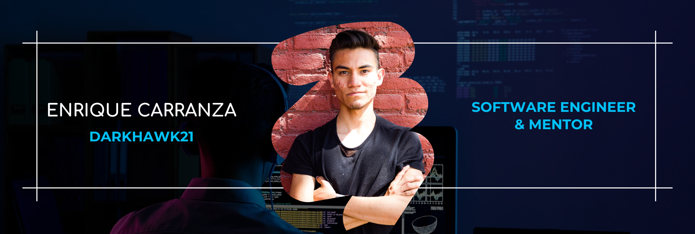

<h1 align="center">
    Hello!
    
</h1>
  


<div id="header" align="center">
    <div id="badges">
        <a href="https://www.youtube.com/channel/UCdJGbm8DEnTL37F9m6R6ChQ/" target="_blank">
            
        </a>
        <a href="https://www.linkedin.com/in/enriquecb21/">
            
        </a>
        <a href="https://www.instagram.com/darkhawk.dev/" target="_blank">
            
        </a>
        <a href="https://darkhawk21.com/" target="_blank">
            
        </a>
    </div>
</div>

---
### :man_technologist: About me:

```js
import SoftwareEngineer from 'enriqueCarranza';

class Bio extends SoftwareEngineer {
    name: 'Enrique Carranza',
    pronouns: "he" | "him",
    passions: [
        'Software development',
        'Software Architecture',
        'Fullstack developer',
        'Programming mentor'
    ],
    title: 'Software Engineer',
    grade: 'Computer engineer',
    company: 'KeyPro | Remote',
    location: 'Mexico'
}

class Skills extends SoftwareEngineer {
    languages: [JavaScript, TypeScript, HTML5, CSS3, PHP, PYTHON, JAVA, NodeJS],
    databases: ['MySQL', 'MongoDB', 'Firebase', 'SQLServer'],
    frontendFrameworks: ['VueJS', 'ReactJS', 'AngularJS'],
    backendFrameworks: ['Laravel', 'ExpressJS', 'DJango'],
    others: ['WordPress', 'ElectronJS', 'SASS', 'TailwindCSS']
}
```
---

### :fire: My Stats :
<div align="center">  
  
</div>
<div align="center">
  
</div>
